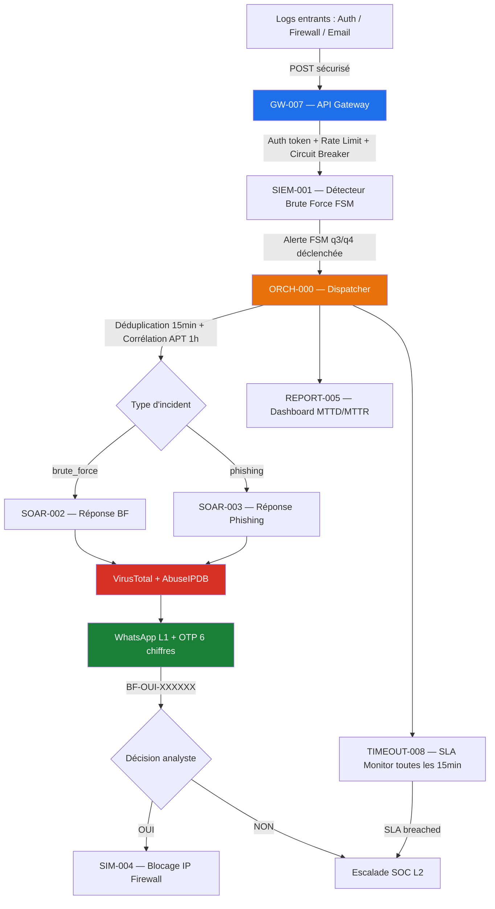
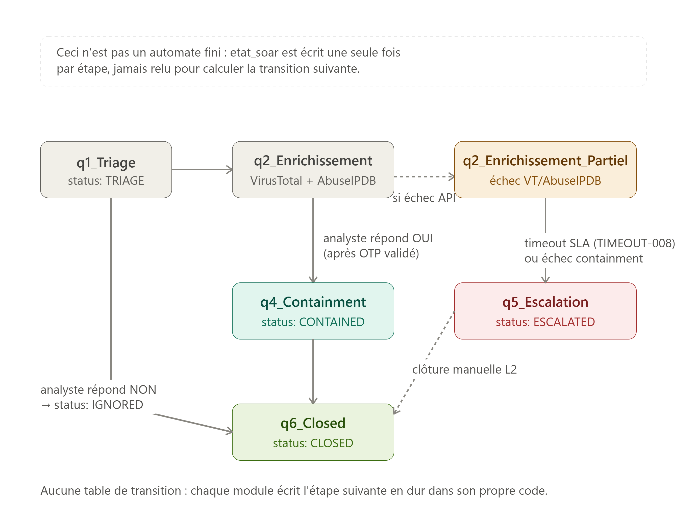

# 🛡️ SOC Automation Platform — SIEM/SOAR avec n8n


> Plateforme SOC open-source complète : détection temps réel par automate fini (FSM),
> orchestration de réponse automatisée, enrichissement Threat Intelligence
> (VirusTotal + AbuseIPDB), validation analyste par OTP WhatsApp,
> monitoring SLA et dashboard métriques MTTD/MTTR.
>
> Développé dans le cadre d'un projet académique — ENSAM Casablanca.

---

## Architecture



---

## Fonctionnalités

| ID | Workflow | Rôle | Points techniques |
|----|----------|------|-------------------|
| `SIEM-001` | BruteForce Detector | Détection FSM q0→q4 | Automate fini, seuil 5 échecs / 10 min, persistance PostgreSQL |
| `SOAR-002` | BruteForce Response | Réponse automatisée + OTP | VirusTotal, AbuseIPDB, retry backoff exponentiel, OTP Supabase Edge |
| `SOAR-003` | Phishing Response | Isolation, purge emails, scan AV | 3 actions parallèles, OTP analyste, escalade L2 |
| `ORCH-000` | Incident Dispatcher | Déduplication + corrélation APT | Cache PostgreSQL 15min dedup, 1h corrélation, routing playbook |
| `GW-007` | API Gateway | Auth + Rate Limiting | Token auth, 100 req/min par IP, circuit breaker |
| `RELAY-010` | Twilio HMAC Validator | Anti-spoofing SMS | Vérification signature HMAC-SHA1 Twilio sur chaque callback |
| `RESP-006` | Response Dispatcher | Routing SMS analyste | Parse format `BF-OUI-123456`, routing vers playbook correct |
| `REPORT-005` | Metrics Dashboard | KPIs SOC temps réel | MTTD, MTTR, SLA compliance, automation rate, security posture |
| `SIM-004` | Firewall Simulator | Simulation EDR/FW | block_ip, isolate_host, purge_emails, full_av_scan |
| `TIMEOUT-008` | SLA Escalation | Monitoring SLA | Scheduler toutes les 15min, escalade WhatsApp L2 automatique |

---

## Automates finis et logique d'état

Le projet contient **un seul automate fini formel** (SIEM-001) et **deux pipelines de cycle de vie** (SOAR-002, SOAR-003) qui réutilisent une notation similaire (`q1`, `q2`...) sans en être mathématiquement — distinction volontairement explicitée ci-dessous pour rester rigoureux.

### SIEM-001 — Automate fini de détection brute force

Véritable FSM à 5 états, persistée en base (table `fsm_sessions`) pour survivre aux redémarrages de l'instance n8n. Table de transition δ(état, événement) → état, alphabet fixe `{auth_fail, port_scan, priv_escalation, phishing, data_exfil, timeout, resolved}`, états accepteurs `q3` et `q4`.


| État | Sévérité | Priorité | Déclenche une alerte |
|------|----------|----------|------------------------|
| `q0` — Repos | INFO | P4 | Non |
| `q1` — Suspicion | LOW | P3 | Non |
| `q2` — Reconnaissance | MEDIUM | P2 | Non |
| `q3` — Menace active | HIGH | P1 | Oui (une fois, via flag `alertSent`) |
| `q4` — Compromission critique | CRITICAL | P0 | Oui (réarmée à chaque nouvel événement grave) |

Tout événement `timeout` ou `resolved` ramène l'automate à `q0` et réinitialise le compteur, quel que soit l'état courant — ce qui évite qu'un incident résolu reste indéfiniment marqué comme actif et limite les faux positifs sur des erreurs de saisie ponctuelles.

### SOAR-002 / SOAR-003 — Cycle de vie de l'incident (pas une FSM)

Une fois l'alerte transmise par SIEM-001, les playbooks SOAR-002 et SOAR-003 font progresser l'incident à travers un **pipeline séquentiel de statuts** (champ `etat_soar`). Contrairement à SIEM-001, il n'existe ici aucune table de transition générale : chaque nœud `Code_*` du workflow écrit la valeur suivante en dur, sans jamais relire l'état précédent pour décider de la transition. C'est un suivi de cycle de vie, pas un automate.



| Étape | Signification |
|-------|----------------|
| `q1_Triage` | Incident créé, en attente d'enrichissement |
| `q2_Enrichissement` | Enrichi avec succès via VirusTotal + AbuseIPDB |
| `q2_Enrichissement_Partiel` | Enrichissement partiel suite à un échec API |
| `q4_Containment` | Décision analyste OUI reçue, action de containment exécutée |
| `q5_Escalation` | Timeout SLA ou échec de containment — escaladé en L2 |
| `q6_Closed` | Incident clôturé (containment réussi ou décision NON de l'analyste) |

---

## Mapping MITRE ATT&CK

| Technique | Nom | Tactic | Workflow |
|-----------|-----|--------|----------|
| `T1110.001` | Password Guessing | Credential Access | SIEM-001 + SOAR-002 |
| `T1110.004` | Credential Stuffing | Credential Access | SIEM-001 + SOAR-002 |
| `T1566.002` | Spearphishing Link | Initial Access | SOAR-003 |

---

## Base de données — 7 tables PostgreSQL

| Table | Rôle | TTL |
|-------|------|-----|
| `incidents` | Table principale SOC — tous les champs MITRE, SLA, FSM, TI | Permanente |
| `fsm_sessions` | États FSM par IP pour la détection brute force | Purge après 2h inactivité |
| `otp_challenges` | Codes OTP WhatsApp générés par Supabase Edge Function | 5 minutes |
| `dedup_cache` | Cache de déduplication pour éviter les doublons d'incidents | 15 minutes |
| `correlation_cache` | Corrélation APT persistante par IP | 1 heure |
| `workflow_logs` | Logs structurés de tous les workflows n8n | 30 jours |
| `threat_intel_cache` | Cache AbuseIPDB + VirusTotal pour limiter les appels API | 6 heures |

La vue `vw_soc_dashboard` calcule en temps réel : MTTD, MTTR, SLA compliance, automation rate, maturity level et security posture (GREEN / AMBER / RED) sur les 24 dernières heures.

Le schéma complet avec index partiels, triggers, fonctions de purge et RLS est dans [`database/schema.sql`](database/schema.sql).

---

## Métriques SOC calculées automatiquement

- **MTTD** — Mean Time To Detect : temps entre le premier log et la création de l'incident
- **MTTR** — Mean Time To Respond : temps entre la création de l'incident et sa clôture
- **SLA Compliance** — pourcentage d'incidents résolus dans les délais impartis
- **Automation Rate** — pourcentage d'incidents résolus sans intervention humaine
- **Security Posture** — GREEN / AMBER / RED selon les incidents P0, les SLA breaches et le MTTR
- **Maturity Level** — ELITE / MATURE / EN PROGRESSION / INITIAL selon le MTTR moyen

---

## Stack technique

| Catégorie | Technologie |
|-----------|-------------|
| Orchestration SOAR | n8n Cloud (10 workflows) |
| Base de données | PostgreSQL via Supabase (7 tables, RLS, index partiels) |
| Alerting analyste | Twilio WhatsApp + SMS |
| Threat Intelligence | VirusTotal API + AbuseIPDB |
| OTP sécurisé | Supabase Edge Functions (Deno, Web Crypto API) |
| Dashboard | HTML / CSS / JavaScript vanilla |
| Tests | Python 3 (chargement sécurisé depuis .env, 50+ assertions) |

---

## Structure du projet
siem-soar-n8n/
├── README.md
├── .env.example                          # variables d'environnement — modèle
├── .gitignore
├── workflows/                            # 10 workflows n8n exportés en JSON
│   ├── GW-007_API_Gateway.json
│   ├── SIEM-001_BruteForce_Detector.json
│   ├── ORCH-000_Incident_Dispatcher.json
│   ├── SOAR-002_BruteForce_Response.json
│   ├── SOAR-003_Phishing_Response.json
│   ├── RESP-006_Response_Dispatcher.json
│   ├── RELAY-010_Twilio_HMAC_Validator.json
│   ├── REPORT-005_Metrics_Dashboard.json
│   ├── SIM-004_Firewall_Simulator.json
│   └── TIMEOUT-008_SLA_Escalation.json
├── database/
│   ├── schema.sql                        # schéma complet Supabase — à exécuter dans SQL Editor
│   └── edge-functions/
│       └── generate-otp.ts               # Edge Function Deno — génération OTP cryptographique
├── dashboard/
│   └── soc_dashboard.html                # dashboard SOC — métriques temps réel
├── images/
│   ├── n8n-workflows.png
│   ├── database.png
│   ├── soc_dashboard.png
│   ├── SOAR_002_workflow.png
│   ├── fsm_siem001_automate.png
│   └── soar002_incident_lifecycle.png
├── docs/
│   └── incident_response_playbook.md     # playbooks brute force et phishing
└── test/
└── soc_test_suite.py                 # suite de tests Python — 50+ assertions

---

## Installation

### Prérequis

- Compte n8n Cloud ou instance Docker self-hosted
- Compte Supabase (tier gratuit suffisant)
- Compte Twilio avec WhatsApp Sandbox activé
- Clé API AbuseIPDB (gratuit, 1000 req/jour)
- Clé API VirusTotal (gratuit, 500 req/jour)
- Python 3.8+ avec pip (pour la suite de tests)

---

### Étape 1 — Base de données Supabase

1. Crée un projet sur [supabase.com](https://supabase.com)
2. Va dans **SQL Editor** et exécute `database/schema.sql` intégralement — crée les 7 tables, les index, les fonctions de purge, la vue dashboard et le RLS
3. Déploie l'Edge Function OTP :
```bash
supabase functions deploy generate-otp --project-ref TON_PROJECT_REF
```
Le fichier source est dans `database/edge-functions/generate-otp.ts`

4. Dans Supabase → Settings → Edge Functions → Secrets, ajoute le secret `OTP_EDGE_TOKEN` avec la valeur que tu généreras à l'étape 2
5. Note ton **Project URL** et ta **service_role key** — tu en auras besoin pour n8n

---

### Étape 2 — Variables d'environnement

```bash
cp .env.example .env
# Ouvre .env et remplis chaque valeur
```

Génère des tokens sécurisés pour chaque variable avec :
```bash
python3 -c "import secrets; print(secrets.token_urlsafe(16))"
```

Reporte ensuite les mêmes variables dans **n8n → Settings → Variables**.

---

### Étape 3 — Import des workflows n8n

Dans n8n → Workflows → Import from file, importe les JSON dans cet ordre précis :
SIM-004_Firewall_Simulator.json        ← infrastructure de base
GW-007_API_Gateway.json
SIEM-001_BruteForce_Detector.json
ORCH-000_Incident_Dispatcher.json
SOAR-002_BruteForce_Response.json
SOAR-003_Phishing_Response.json
RESP-006_Response_Dispatcher.json
RELAY-010_Twilio_HMAC_Validator.json
REPORT-005_Metrics_Dashboard.json
TIMEOUT-008_SLA_Escalation.json

Active chaque workflow après import.

---

### Étape 4 — Simuler une attaque brute force

Ce script envoie 10 tentatives d'authentification échouées depuis la même IP pour déclencher la détection FSM :

```bash
for i in {1..10}; do
  curl -X POST https://TON_N8N_URL/webhook/siem-logs \
    -H "x-soc-token: TON_SIEM_TOKEN" \
    -H "Content-Type: application/json" \
    -d '{
      "type": "auth_fail",
      "ip": "185.220.101.45",
      "user": "admin",
      "session_id": "SESS-DEMO-001"
    }'
  sleep 2
done
```

**Résultat attendu :** alerte WhatsApp reçue après le 5e échec, incident créé dans Supabase avec enrichissement VirusTotal + AbuseIPDB, OTP envoyé à l'analyste L1 pour décision, blocage IP déclenché après validation.

---

### Étape 5 — Lancer la suite de tests

```bash
pip install requests python-dotenv
cp .env.example .env
# Remplis .env avec tes vraies valeurs
python test/soc_test_suite.py
```

La suite couvre : SIEM-001, ORCH-000, SIM-004, REPORT-005, GW-007, RESP-006, SOAR-002, SOAR-003, RELAY-010, TIMEOUT-008, et les injections SQL / inputs malveillants.

---

### Étape 6 — Dashboard

Ouvre `dashboard/soc_dashboard.html` dans un navigateur. Configure l'URL de ton endpoint REPORT-005 dans le fichier pour afficher les métriques en temps réel.

---

## Sécurité

- Tous les tokens inter-workflows sont injectés via n8n Variables — jamais en dur dans le code
- La validation HMAC-SHA1 de Twilio est activée via RELAY-010 pour prévenir le spoofing SMS
- Les OTP sont générés avec Web Crypto API (CSPRNG) via Supabase Edge Functions, stockés hashés, et expirés après 5 minutes
- RLS (Row Level Security) activé sur les 7 tables Supabase — seul le `service_role` n8n peut écrire
- Le fichier `.env` est exclu du versionnement par `.gitignore`
- L'API Gateway (GW-007) applique un rate limit de 100 req/min par IP et un circuit breaker sur les services downstream

---

## Pourquoi ces choix d'architecture

**FSM plutôt qu'un simple compteur de seuil** — Un compteur classique (`if failed_attempts > 5`) ne distingue pas une attaque en cours d'une activité terminée, et ne peut pas représenter d'états intermédiaires de surveillance progressive. La FSM permet de modéliser explicitement le passage de l'observation passive (q1, q2) à l'alerte active (q3, q4), avec un reset automatique en cas de succès d'authentification — ce qui réduit les faux positifs sur les utilisateurs qui se trompent simplement de mot de passe une ou deux fois.

**OTP plutôt qu'une simple confirmation par bouton** — Un simple lien "Confirmer" cliquable est vulnérable au phishing et ne garantit pas que c'est bien l'analyste assigné qui valide la décision. Le challenge OTP envoyé sur le téléphone de l'analyste, généré avec un CSPRNG côté serveur (Web Crypto API), garantit que la décision de containment provient d'une personne en possession physique du device enregistré, avec une fenêtre de validité de 5 minutes pour limiter le risque de réutilisation.

**Cache TI plutôt qu'un appel API à chaque incident** — VirusTotal et AbuseIPDB ont des quotas gratuits limités (500 et 1000 requêtes/jour). Sans cache, une même IP attaquante revenant plusieurs fois dans la journée épuiserait rapidement le quota et bloquerait l'enrichissement pour les vrais nouveaux incidents. Le cache à 6h équilibre fraîcheur de la donnée et consommation de quota.

**Corrélation persistante en base plutôt qu'en mémoire n8n** — Le StaticData de n8n est volatile et disparaît lors d'un redémarrage de l'instance ou d'une réactivation de workflow. Stocker la corrélation APT dans la table `correlation_cache` plutôt qu'en StaticData garantit que l'historique de corrélation survit aux redémarrages d'instance et aux déploiements, ce qui est critique pour détecter des patterns d'attaque étalés sur plusieurs heures.

**Pipeline de statuts plutôt qu'une seconde FSM pour SOAR-002/003** — Contrairement à la détection brute force où le nombre d'états et de transitions possibles justifie une vraie table de transition, le déroulement d'un playbook de réponse est intrinsèquement linéaire (triage → enrichissement → décision → containment/escalade → clôture). Modéliser ça comme une FSM aurait ajouté de la complexité sans bénéfice : un simple champ de statut écrit séquentiellement suffit et reste plus lisible pour le débogage.

---

## Ce que j'ai appris

- Concevoir une **architecture événementielle SOC** avec séparation des responsabilités (detection / orchestration / response / reporting)
- Implémenter un **automate fini (FSM)** pour la détection stateful de brute force avec persistance en base, et savoir reconnaître quand un pipeline séquentiel suffit plutôt qu'une FSM complète
- Sécuriser les appels inter-services avec **HMAC-SHA1** et authentification par token Bearer
- Construire un **flux de validation OTP multi-facteur** pour les décisions critiques d'analystes SOC
- Intégrer des **APIs de Threat Intelligence** (VirusTotal, AbuseIPDB) avec cache pour optimiser les quotas
- Mesurer la performance SOC avec les métriques **MTTD / MTTR / SLA compliance / automation rate**
- Écrire une **suite de tests automatisés** couvrant les cas nominaux, les rejets de sécurité et les injections SQL

---

## ⚠️ Disclaimer

Projet académique à des fins éducatives. Toutes les valeurs dans `.env.example` sont des placeholders. Ne jamais committer de vraies clés API. Les IPs utilisées dans les tests sont fictives ou appartiennent à des plages de documentation.

---

## Auteur

ZOUBDANE RANYA — Étudiante en Cybersécurité | ENSAM Casablanca
Spécialisation : Blue Team · SOC · Détection & Réponse aux incidents

[](https://linkedin.com/in/TON_PROFIL)
[](https://github.com/rani27-bipo)
